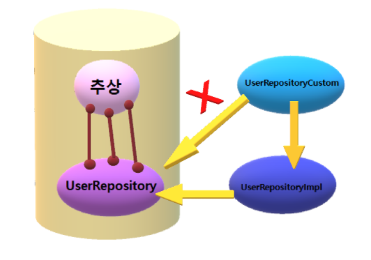

# 🏷️스프링부트 기초 - JPA QueryDSL 학습

#### ✅ Query DSL
* 장점 : 복잡한 쿼리를 만들 수 있다.
* 단점 : 코딩을 더 많이 해야한다.

#### ✅ 일반 JPA 함수
* 장점 : 사용법이 단순하다.
* 단점 : 복잡한 쿼리를 만들 수 없다.

#### ✅ 학습 내용
* QueryDSL을 사용하려면 엔티티 클래스로는 부족하다.

    QueryDSL을 사용하려면 각 엔티티 클래스로부터 파생된 Q클래스가 필요하다.    
    
    Q클래스는 각각의 엔티티 클래스로 부터 파생되는 클래스 이다.

    엔티티를 학습해서 Q 클래스를 만들어낸다.

    사람이 직접 Q클래스를 구현해도 되지만 Gradle => Tasks => other => compileQueryDsl 기능을 실행하면 자동으로 만들어진다.
     
     

    ##### 🔻 compileQueryDsl 를 해야하는 상황

    - git clone을 했을 때
    - 엔티티 클래스의 내용을 변경했을 때
    - 엔티티를 학습해서 Q 클래스를 만들어낸다.
  
   
  
                
        ➡️Entity 파일 수정시마다 눌러줘야 한다.
 
 
  
       
       
        ➡️Q클래스가 자동으로 생성되었다.
   
   
  
* UserRepository 클래스의 계보

 
 
* static import를 이용해서 DSL 간소화
 
 

 

          

* InitData
 
 테스트용샘플데이터 와 개발용 샘플 데이터를 등록해놓을 수 있다.