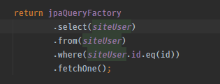

# 🏷️스프링부트 기초 - JPA QueryDSL 학습

#### ✅ Query DSL
* 장점 : 복잡한 쿼리를 만들 수 있다.
* 단점 : 코딩을 더 많이 해야한다.

#### ✅ 일반 JPA 함수
* 장점 : 사용법이 단순하다.
* 단점 : 복잡한 쿼리를 만들 수 없다.

#### ✅ 학습 내용
* 엔티티를 학습해서 Q 클래스를 만들어낸다.
    
  
       
       
* UserRepository 클래스의 계보

 
 
* static import를 이용해서 DSL 간소화

